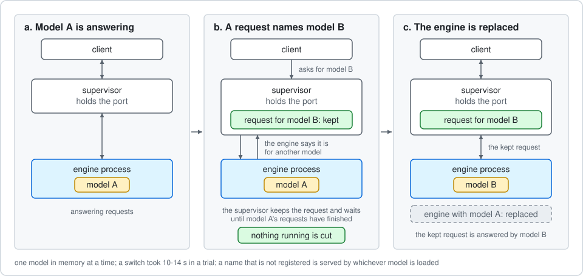
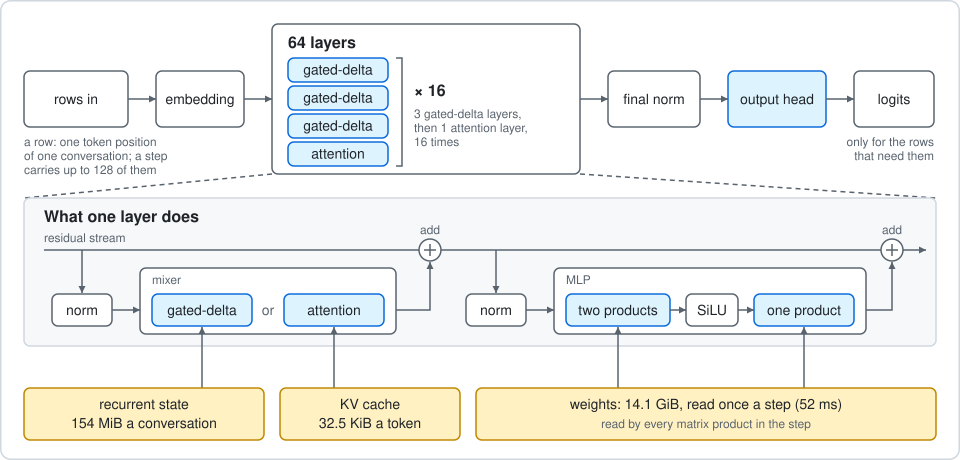
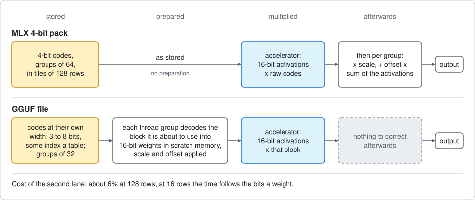
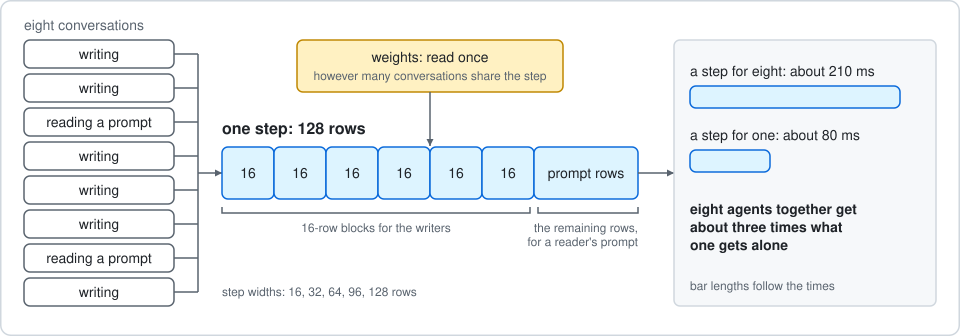

# Splosh

A Swift and Metal inference engine for **Qwen3.8-27B** (the MLX 4-bit pack, or Unsloth's GGUF
files at their own size) on Apple silicon, with an OpenAI-compatible server built for what
agent harnesses actually send: several long conversations at once, each growing by a tool
result at a time. It is inspired by ideas in [Splash](https://github.com/incoai/splash) and
[Splish](https://github.com/publicExcess/splish).

It exists to be fast at two things: reading long prompts (prefill) and writing replies
(decode). This page says how to run it, and then why it is as fast as it is.

If it is useful to you, you can put something in
[Andy's Tea Fund](https://buymeacoffee.com/andysteafund).

## What it does on an M5 Pro

Measured 2026-10-03 on an M5 Pro (20-core GPU, 64 GB), High Power mode, against Splash 1.1.0
(`incoai/splash`) and Splish (a tuned fork of it). The model is the same 4-bit Qwen3.8-27B in
all three: Splosh ran the `mlx-community/Qwen3.8-27B-4bit` pack, and Splash and Splish ran
`incoai/Qwen3.8-27B-Splash`, Inco's package of that pack. Each engine alone in memory; every
prompt new, so no cache helps; greedy, thinking off, an 800-token essay as the reply; two
passes in opposite orders, mean shown.

| Prompt (4-bit weights) | Prefill, tokens/s (Splosh / Splish / Splash) | Decode, tokens/s (Splosh / Splish / Splash) |
|---|---|---|
| 10.7K tokens | 467 / **484** / 450 | **35.9** / 35.6 / 30.8 |
| 54.5K | 388 / **394** / 364 | **32.8** / 32.3 / 27.0 |
| 165.7K | **276** / 264 / 251 | **25.8** / 24.7 / 23.8 |
| 221.3K | **241** / 228 / 224 | **23.5** / 22.9 / 21.0 |

| Four 21K prompts sent together (4-bit weights) | Splosh | Splish | Splash |
|---|---|---|---|
| All four replies finished | **251 s** | 270 s | 282-285 s |
| Every token, prompt and reply, over that time | **354 /s** | 330 /s | 313-316 /s |

Essays are the slowest thing to decode, because a draft model guesses prose badly. On the same
4-bit pack, code runs at 92-98 tokens/s for one session at short context, and eight agents
writing code at once (about 23K tokens of context each) were generating 156-175 tokens/s
between them in a live run.

With Unsloth's Q5 file (`UD-Q5_K_M`, 18.2 GiB of weights) and more than 150K tokens of context,
a session writing code was seen at about 85 tokens/s: 84.4 on the dashboard at 171K tokens,
with 13.9 tokens a step and 99% of drafts accepted.

These are one machine's figures. How they were taken, and what else was tried, is in
[`audit/SPEED-PLAN-RESULTS.md`](audit/SPEED-PLAN-RESULTS.md); the harness is
`tools/bench/engine-report`.

## Requirements

- An Apple silicon Mac whose GPU has the neural accelerator that Metal 4's tensor operations
  run on. It was developed and measured on an M5 Pro only; nothing else has been tried.
- macOS 27 and Xcode 27 (Swift 6, the Metal toolchain with `MetalPerformancePrimitives`).
- Memory: 14.1 GiB for the weights (15 to 21 GiB for the Unsloth files, below), 154 MiB of
  recurrent state per conversation slot, and 32.5 KiB of KV cache per token of context, taken
  from a shared pool as contexts grow. On 64 GB the pool holds about 570K tokens across all
  conversations with the 4-bit pack.

## Running it

**1. Build.**

```bash
make shaders && swift build -c release --disable-sandbox
```

**2. Get the model.** The weights are the `mlx-community/Qwen3.8-27B-4bit` pack (16 GB), at a
pinned revision. The first command fetches the tokenizer and config, the second the pack. The
script needs the Python packages pinned in `requirements.lock`.

```bash
python3 tools/fetch_inputs.py --fetch
```

```bash
python3 tools/fetch_inputs.py --fetch-pack mlx-q4
```

**3. Convert it**, from the repository root: once to Splosh's format, once more into the tiled
layout the engine runs from (the server looks for `.build/q4/weights.tiled.splw`;
`weightsPath` in `splosh.toml` points it elsewhere).

```bash
.build/release/splosh convert --input inputs/mlx-q4 --out .build/q4/weights.splw --verify
```

```bash
.build/release/splosh convert --retile --input .build/q4/weights.splw --out .build/q4/weights.tiled.splw
```

**4. Optional but worth it: the draft model.** Speculative decoding uses the DFlash 2 draft
checkpoint `incoai/Qwen3.8-27B-DFlash2`. The server picks it up from the Hugging Face cache
(`~/.cache/huggingface/hub`) if it is there, or from `draftPath`. Without it Splosh decodes one
token a step, about 16 tokens/s.

**5. Serve.**

```bash
.build/release/splosh serve
```

It listens on `127.0.0.1:8091` only. Point any OpenAI-compatible client at
`http://127.0.0.1:8091/v1` with model `qwen3.8-27b`:

```bash
curl http://127.0.0.1:8091/v1/chat/completions -H 'content-type: application/json' -d '{"model":"qwen3.8-27b","stream":true,"messages":[{"role":"user","content":"Write a Python function that merges overlapping intervals."}]}'
```

What the server gives you:

- `POST /v1/chat/completions`, streaming or whole, with tools, `stop`, `temperature`, `top_p`,
  `top_k`, `seed`, and `reasoning_effort` (`none` turns thinking off). Text only: no images.
- `GET /v1/models`: every model the server can load, the loaded one first (see "Several
  models" below). `GET /v1/stats` for everything the dashboard shows, as JSON.
- A dashboard at `http://127.0.0.1:8091/`: each session's context, progress and rates, memory,
  cached conversations, time spent outside the GPU's steps, and step times by width. Rest the
  pointer on a session to watch its reply being written, in a small window that can be made
  larger; a click opens the large one. The window stays with the conversation from one request
  to the next. The text comes from `GET /v1/sessions/<id>/reply`.
- A settings page at `/settings` that edits `splosh.toml` and can restart the engine.
- `splosh serve --restart`, from another terminal: the engine is replaced (a new build, new
  settings) while the port stays open. Requests in flight finish, new ones wait, and every
  conversation is picked up from disk where it was.
- Ctrl+C lets requests finish and writes every conversation to disk before exiting.


### Settings

All optional, in `./splosh.toml` or the file given to `--config`.

| Key | Default | Meaning |
|---|---|---|
| `port`, `host` | 8091, 127.0.0.1 | where to listen |
| `slots` | 8 | conversations that can hold state at once, running or cached |
| `concurrency` | as many as slots | most requests worked on at once; the rest queue |
| `contextWindow` | 262144 | longest prompt accepted |
| `kvPages` | sized from memory | KV pool in 256-token pages, shared by all sessions |
| `draftPath` | Hugging Face cache | `none` disables speculative decoding |
| `prefixCacheDir` | `~/Library/Caches/Splosh/prefix-cache` | conversations on disk; `none` disables |
| `prefixCacheGiB` | 16 | disk budget; least recently used go first |
| `decodeWeight` | 1 | how a step is shared between sessions that are writing and prompts that are waiting. 1 gives a waiting prompt a full-width step with the writers riding along (best for agent batches); 20 or more leaves a running stream untouched |
| `answerReserve` | 8192 | tokens of a reply's limit kept for its answer: thinking that has used the rest is closed by the server, so an answer is still written. At most a quarter of the limit; 0 lets thinking run to the limit |
| `toolCallOverrun` | 8192 | tokens a tool call in progress at a reply's limit may run past it, so the reply ends on a whole call and an agent carries on; 0 ends every reply at its limit |
| `requestLog` | true | one line per finished request: tokens reused, evaluated, generated, rates, and where the time outside the GPU went |
| `model`, `model.<id>` | none | the models the server can load, and the one it starts on (see "Several models") |
| `modelSwitch` | request | `request`: a chat naming another registered model has it loaded. `manual`: only `splosh models --load` does |
| `modelDwellSeconds`, `switchWaitSeconds` | 60, 120 | how long a model just loaded is kept before another may replace it, and how long a request for another model waits for the loaded one to go idle before it is refused |

`splosh cache stats` lists what is stored on disk and `splosh cache purge --all` clears it.
`tools/serve-smoke` is the end-to-end test: it loads the real model and checks, among other
things, that greedy output matches reference token ids from `mlx-lm`.

### Unsloth's GGUF files

Splosh also runs the quantisations of the same model in
[`unsloth/Qwen3.8-27B-GGUF`](https://huggingface.co/unsloth/Qwen3.8-27B-GGUF), at the size
they are on disk. They buy accuracy with bytes: more bits a weight means more to read on every
step, so decode slows roughly in proportion while prefill barely changes.

| Name used here | Weights | Bits a weight | In memory | Weight error |
|---|---|---|---|---|
| `mq4` | MLX 4-bit pack | 4.5 | 14.1 GiB | 9.3% |
| `uq4` | `UD-Q4_K_M` | 4.79 | 15.0 GiB | 6.7% |
| `uq5` | `UD-Q5_K_M` | 5.77 | 18.1 GiB | 3.8% |
| `uq6` | `UD-Q6_K_M` | 6.76 | 21.2 GiB | 2.2% |

Weight error is the RMS difference from the MLX 8-bit pack, relative, over a sample of rows
from every fourth layer (`tools/gguf_check.py <file.gguf> --reference mlx-q8`). It is a plain
measure of the weights: it gives no credit for Unsloth's calibration, which spends its
precision where the outputs are most sensitive.

What has been measured, 2026-10-03, on the M5 Pro:

- **`uq5` is correct.** Its greedy continuation equals llama.cpp's on the same file, token for
  token, for 64 and 96 tokens, with the prompt read through each of the three kernel shapes
  (`tools/gguf-compare`). `uq4` and `uq6` load and answer sensibly but have not been compared.
- **`uq5` against `mq4`**, one session through `splosh generate`, the same binary, power mode
  Automatic (so both sides are below the High Power figures above), runs alternated: code with
  speculation 61 against 73 tokens/s; an essay 22 against 31; a 9.6K-token prompt 319-388
  against 268-362 tokens/s. A 16-row decode step takes 121 ms against 87. `uq4` and `uq6` have
  not been timed.

To add one, download the file and convert it. Conversion only re-orders the codes into the
layout the kernels read; it takes about half a minute and the result is the size of the
source.

```bash
hf download unsloth/Qwen3.8-27B-GGUF Qwen3.8-27B-UD-Q5_K_M.gguf --local-dir inputs/gguf
```

```bash
.build/release/splosh convert --input inputs/gguf/Qwen3.8-27B-UD-Q5_K_M.gguf --out .build/gguf/ud-q5_k_m.splw
```

Then either point `weightsPath` at the artifact or register it as a model. The formats
understood are Q4_K, Q5_K, Q6_K, Q3_K, Q8_0, IQ4_NL, IQ4_XS and IQ3_S, which is everything in
the three files above; a file holding any other is refused, with the tensor named. The MTP
block these files carry is not used.

### Several models

Register models by name in `splosh.toml` and the server can change between them. Only one is
in memory at a time.

```
model = "uq5"
model.mq4 = ".build/q4/weights.tiled.splw"
model.uq4 = ".build/gguf/ud-q4_k_m.splw"
model.uq5 = ".build/gguf/ud-q5_k_m.splw"
model.uq6 = ".build/gguf/ud-q6_k_m.splw"
```

- `model` is the one the server starts on; `splosh serve --model uq6` overrides it.
- **A chat request that names another registered model has it loaded** in place of the one in
  memory. Nothing running is cut: the request waits until the loaded model's requests have
  finished, the engine is replaced, and the request is answered by the new model. A switch
  took 10-14 s in a trial. A name that is not registered (`qwen3.8-27b`, say) is served by
  whichever model is loaded, so existing clients need no change.
- **Pick from a list** on the settings page or in the dashboard's header: each model is shown
  with its size and file, and Load switches to it.
- `splosh models` prints the list and marks the loaded one; `splosh models --load uq4`
  switches from the command line. `GET /v1/models` returns the same list.
- A model that is still busy after `switchWaitSeconds` keeps its place and the request for the
  other gets a 503 to retry; a model that fails to load gives way to the one before it.
- Conversations on disk are kept per model, and found again when the server comes back to it.



`tools/switch-smoke` tests all of this without loading a model.

## Why it is fast

Three numbers about the machine decide almost everything.

- The GPU reads memory at about 290 GB/s, so **one pass over 14 GiB of weights takes 52 ms**.
  A step that produces one token can never beat 19 tokens a second.
- The GPU's neural accelerator multiplies 4-bit weights by 16-bit activations at about
  **14 trillion multiply-adds a second**, far beyond what ordinary shader arithmetic manages.
- Every point in a step where one piece of work must wait for another costs **40-60
  microseconds**, and a step has hundreds.

So prefill has to keep the accelerator saturated and waste nothing around it, and decode has
to get more than one token out of each pass over the weights.



### Prefill

**The weights stay 4-bit all the way to the multiplier.** The MLX pack stores each group of 64
weights as 4-bit codes with a scale and an offset. Splosh hands the codes to the accelerator
as they are and applies scale and offset to the product afterwards, 64 inputs at a time.
Nothing is expanded to 16 bits in memory, so a step reads 14 GiB, not 56.

**GGUF weights are decoded a block at a time, on the way in.** Most of what a GGUF file holds
cannot go to the accelerator as stored: 5- and 6-bit codes, and codes that index a table.
Widening them to bytes on disk would nearly double what a step reads. So the codes stay at
their own width, and each group of threads turns the block it is about to multiply into 16-bit
weights in its scratch memory, scale and offset already applied; the accelerator multiplies by
that. At 128 rows this costs about 6% more than the raw 4-bit path for the same product; at 16
rows the time follows the bits a weight (Q5_K 28% more than raw 4-bit, Q6_K 60%), because a
narrow step is bound by how fast the weights can be read.



**The file is laid out in the order the GPU reads it.** Weights are stored as tiles of 128
output rows, group by group, so each thread group streams one contiguous block. The file is
mapped once and used in place.

**128 prompt tokens a step, in tiles of 32 by 128.** That shape gives each group of GPU
threads the 32 x 32 block of results it handles best. At this width the step is limited by the
accelerator's own rate, not by memory: making steps wider (up to 2,048 rows) changed nothing.

**Kernels are kept small.** The same arithmetic ran 7% faster as a kernel with nothing
optional in it than as one mode of a general kernel, and a single run-time flag cost 20%. What
a kernel carries, not only what it executes, decides how many copies the GPU keeps running.

**Stages are removed, not tuned.** The matrix product that updates the residual stream also
writes the normalised input the next product needs, so the normalisation pass between them is
gone. The gated-delta layers run as three dispatches. Removing a stage is worth more than
speeding one up.

**Attention is one kernel on the accelerator.** Keys and values are stored as 8-bit codes with
one scale per vector (32.5 KiB a token; 4-bit was tried and was worse in both accuracy and
speed). For each block of eight rows the kernel computes scores against 64 tokens at a time,
turns them into probabilities with the softmax laid out so that sums and maxima stay in
registers, and multiplies by the values, without leaving the GPU's fast path. The context is
split into spans that run side by side and are merged afterwards. The cost is about 3 ms per
thousand tokens of context for a 128-row step.

**Rows nobody will read skip the last layer.** Only the final prompt token needs an output.

**The GPU is not allowed to fall asleep on a conversation.** Weights and scratch memory are
pinned resident, and while the server is idle a tiny pass touches the KV pool twice a second.
Without that, the first step after an agent's tool call waited about a quarter of a second.

**Nothing is evaluated twice.** This matters more than any kernel: in a day of agent traffic
91% of prompt tokens had been seen before.

- Each conversation keeps its state in a slot, and the next request evaluates only what was
  added.
- The model's recurrent layers cannot be rewound, so the state is saved where each prompt
  opens the reply. If the client sends the last reply back differently (without its thinking,
  say), the conversation carries on from there instead of from the start.
- The state at the end of the system prompt is kept, so a new agent with the same
  instructions and tools starts from there. One agent's work never costs another its context.
- Conversations are written to disk and read back at about a second per 50K tokens, across
  restarts and evictions.


### Decode

**Speculative decoding, sized to the hardware.** A small draft model (five layers, reading the
big model's own hidden states) proposes a block of tokens in 7 ms. The big model then checks
the whole block in one pass. A pass that checks 16 rows costs about the same 62 ms as one that
produces a single token, so blocks are 16 long: the eight the draft model was trained to
produce, kept isolated so they are exactly what it would have said alone, and eight more that
count when the first eight are all right. A step yields about 3 tokens on prose, 4-5 on new
code, and 7-10 when the reply restructures code it has been given.

**Copying beats guessing.** When the reply is repeating text already in the context (editing
a file, quoting a tool result), the best draft is the text itself. Splosh keeps an index of
every three-token run in the conversation and proposes what followed last time: about 15
tokens a step, with no draft pass at all.


**A wrong guess costs one step and nothing else.** Rows being checked do not write the
recurrent state; they write a journal, and only the accepted part is folded in. Nothing has to
be recomputed or rolled back.

**The output is the big model's.** Every token is verified. With greedy decoding it is the big
model's own choice; with sampling, the accept-or-reject rule preserves its distribution
exactly.

**The draft model gets the same care as the main one.** Its weights are quantised at load into
the same tiled 4-bit layout (17 ms a pass became 7), with each group's range fitted by least
squares instead of taken from its extremes, which the draft repays with 2% more accepted
tokens.

### Many sessions at once

One thread owns the GPU. Each step it packs rows from every live session into a single pass
over the weights: a block to verify for each session that is writing, and prompt rows for
those still reading. The weights are read once however many sessions share the step: a step
for eight sessions takes about 210 ms where a step for one takes 80, so eight agents together
get about three times what one gets alone, not one eighth each.



Steps come in widths the accelerator likes (16, 32, 64, 96, 128 rows). The scheduler picks the
width that makes the most progress per millisecond, counting what each session's drafts have
been yielding. A prompt that is waiting gets a full-width step with the writers riding in it.

### What did not work

Kept here so nobody tries them again: wider prefill steps, taller tiles, a second verified
branch, 4-bit KV, fusing the MLP's two products with its activation, attention tiles of ten
rows, skipping attention chunks that look negligible (0.2% qualify on a real 85K prompt),
waking the GPU when a request arrives, and relaxed arithmetic. The measurements are in
[`audit/ENGINE-PERFORMANCE-RESEARCH.md`](audit/ENGINE-PERFORMANCE-RESEARCH.md), which is the
full log of what was tried and what each thing was worth.

## Measuring it yourself

Timing on a laptop moves by 20-35% with heat and with what ran a minute ago. Compare
alternatives interleaved, more than once, and say whether a figure is a burst or sustained.

- `tools/bench/step-bench <context> "X=1" "SOME_SWITCH=1"`: engine steps, interleaved.
- `tools/bench/server-ab NAME=PORT NAME=PORT`: two running servers, alternating requests.
- `tools/bench/engine-report`: the whole comparison above.
- The request log and `/v1/stats` say, for real traffic, what was reused, what was evaluated,
  and where each request's time went.

## Where things are

| Path | What |
|---|---|
| `Sources/Shaders/` | the Metal kernels; `candidates/` holds variants, shipped and rejected |
| `Sources/Shaders/engine_gguf.metal`, `gguf_formats.h` | the GGUF kernels and their format decoders |
| `Sources/SploshModel/Gguf*.swift` | reading a GGUF file, its reference decoders, the converter |
| `Sources/SploshRuntime/Engine.swift` | one step: rows in, logits out |
| `Sources/SploshRuntime/BatchScheduler.swift` | sessions, slots, reuse, what goes in each step |
| `Sources/SploshRuntime/DraftModel.swift`, `LookupIndex.swift` | the two sources of drafts |
| `Sources/SploshRuntime/PrefixStore.swift` | conversations on disk |
| `Sources/SploshServer/` | the HTTP API, chat template, tool-call parsing, dashboard |
| `Sources/SploshCLI/` | `serve`, `generate`, `convert`, `models`, `cache`, `doctor`; the supervisor that holds the port and replaces the engine |

## Limits

One model, Qwen3.8-27B, in the quantisations above, one loaded at a time. One class of
machine. Text and tool calls only. It binds to the loopback address
and has no authentication, so it is a local server, not something to expose. It has run under
real agent batches for days, not months.

## Credits

Splosh was built to be measured against Splash and Splish, and it learned from them: the
row-wise layout of the attention softmax follows Splash's, and timing Splash's prefill tile is
what showed that small kernels run faster. The engine for the MLX pack shares no code with
them. The GGUF path does: decoding a block of weights into scratch memory before each product
is how Splash and Splish run GGUF, and the layout of the re-ordered codes and the per-format
decoders in `Sources/Shaders/gguf_formats.h` are adapted from theirs (Apache-2.0).

- The GGUF files are [Unsloth's](https://huggingface.co/unsloth/Qwen3.8-27B-GGUF). The formats,
  the arithmetic that makes a weight of a code and the two tables (`kvalues_iq4nl`,
  `iq3s_grid`) are [llama.cpp](https://github.com/ggml-org/llama.cpp)'s (MIT).

- The model is [Qwen3.8-27B](https://huggingface.co/Qwen/Qwen3.8-27B); the weights are the
  `mlx-community` 4-bit pack.
- The draft checkpoint is Inco's `incoai/Qwen3.8-27B-DFlash2`. The draft model's arithmetic
  follows `dflash/model.py` in `z-lab/dflash` (Apache-2.0).
- Drafts copied from the context (`Sources/SploshRuntime/LookupIndex.swift`) are the copy rule
  of [Splish](https://github.com/publicExcess/splish), which has it from
  [TensorFold](https://github.com/ashhart/TensorFold): when the last tokens of a reply repeat
  earlier text, the draft is what followed them. The idea is theirs; the code is not.
- The HTTP server is [Hummingbird](https://github.com/hummingbird-project/hummingbird).

## Licence

Apache-2.0: see [LICENSE](LICENSE) and [NOTICE](NOTICE). The Apache-2.0 and MIT work named
under Credits keeps its own licence; its notices are in
[THIRD_PARTY_NOTICES](THIRD_PARTY_NOTICES).

## Support

If Splosh is useful to you, you can put something in
[Andy's Tea Fund](https://buymeacoffee.com/andysteafund).

## See also

- [Splash](https://github.com/incoai/splash): Inco's inference engine for Apple silicon, the
  yardstick Splosh was measured against.
- [Splish](https://github.com/publicExcess/splish): a tuned fork of Splash. Its copy rule is
  where Splosh's drafts copied from the context come from.
- [TensorFold](https://github.com/ashhart/TensorFold): where Splish has the copy rule from.
