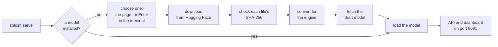

# Splosh

A Swift and Metal inference engine for **Qwen3.8-27B** (the MLX 4-bit pack, or Unsloth's GGUF
files at their own size) on Apple silicon, with an OpenAI-compatible server built for what
agent harnesses actually send: several long conversations at once, each growing by a tool
result at a time. It is inspired by ideas in [Splash](https://github.com/incoai/splash) and
[Splish](https://github.com/publicExcess/splish).

Running it gives you two things on one local port:

- **The model**, behind the OpenAI chat API, so any OpenAI-compatible client or agent harness
  can use it.
- **A web page that shows what the server is doing**, in detail and as it happens: each
  session's context and how far its prompt has been read, the reply as it is being written,
  the rates, the memory in use, the conversations it has cached and where the time of each
  step goes. Two more pages hold the models and the settings.

It exists to be fast at two things: reading long prompts (prefill) and writing replies
(decode). This page says what it does, how to get it running and what the server looks like.
How it is made is in [pages of its own](#how-it-is-made).

<p align="center">
  <a href="https://buymeacoffee.com/andysteafund"></a>
  <br>
  <sub>Splosh is free. If it runs well on your Mac, a tea keeps the work on it going.</sub>
</p>

## Contents

- [What it does on an M5 Pro](#what-it-does-on-an-m5-pro): the measured rates
- [Getting it running](#getting-it-running): from a Mac with nothing installed to a served model
- [The server](#the-server): the API and the dashboard
- [Models](#models): the four there are
- [How it is made](#how-it-is-made): the pages with the detail
- [Limits](#limits)
- [Credits](#credits)
- [Licence](#licence)
- [Support](#support)
- [See also](#see-also)

## What it does on an M5 Pro

Measured 2026-10-03 on an M5 Pro (20-core GPU, 64 GB), High Power mode, against Splash 1.1.0
(`incoai/splash`) and Splish (a tuned fork of it). The model is the same 4-bit Qwen3.8-27B in
all three: Splosh ran the `mlx-community/Qwen3.8-27B-4bit` pack, and Splash and Splish ran
`incoai/Qwen3.8-27B-Splash`, Inco's package of that pack. Each engine alone in memory; every
prompt new, so no cache helps; greedy, thinking off, an 800-token essay as the reply; two
passes in opposite orders, mean shown.

| Prompt (4-bit weights) | Prefill, tokens/s (Splosh / Splish / Splash) | Decode, tokens/s (Splosh / Splish / Splash) |
|---|---|---|
| 10.7K tokens | 467 / **484** / 450 | **35.9** / 35.6 / 30.8 |
| 54.5K | 388 / **394** / 364 | **32.8** / 32.3 / 27.0 |
| 165.7K | **276** / 264 / 251 | **25.8** / 24.7 / 23.8 |
| 221.3K | **241** / 228 / 224 | **23.5** / 22.9 / 21.0 |

| Four 21K prompts sent together (4-bit weights) | Splosh | Splish | Splash |
|---|---|---|---|
| All four replies finished | **251 s** | 270 s | 282-285 s |
| Every token, prompt and reply, over that time | **354 /s** | 330 /s | 313-316 /s |

Essays are the slowest thing to decode, because a draft model guesses prose badly. On the same
4-bit pack, code runs at 92-98 tokens/s for one session at short context, and eight agents
writing code at once (about 23K tokens of context each) were generating 156-175 tokens/s
between them in a live run.

With Unsloth's Q5 file (`UD-Q5_K_M`, 18.2 GiB of weights) and more than 150K tokens of context,
a session writing code was seen at about 85 tokens/s: 84.4 on the dashboard at 171K tokens,
with 13.9 tokens a step and 99% of drafts accepted.

These are one machine's figures. How they were taken, and what else was tried, is in
[`audit/SPEED-PLAN-RESULTS.md`](audit/SPEED-PLAN-RESULTS.md); the harness is
`tools/bench/engine-report`.

## Getting it running

From a Mac with nothing on it to a model being served is five steps. Steps 1 and 4 are the
ones that take time: each is a large download.

| | Step | What it does |
|---|---|---|
| 1 | [Install Xcode](#1-install-xcode) | the compilers for Swift and for the Metal kernels |
| 2 | [Get the code](#2-get-the-code) | `git clone` |
| 3 | [Build](#3-build) | the kernels, then the `splosh` program |
| 4 | [Start the server](#4-start-the-server) | on its first launch it offers the models, and downloads and installs the one you pick |
| 5 | [Use it](#5-use-it) | point a client at the API, and open the dashboard |

**What the Mac needs**

- A GPU with the neural accelerator that Metal 4's tensor operations run on. Splosh was
  developed and measured on an M5 Pro only; nothing else has been tried.
- macOS 27.
- Memory: 14.1 GiB for the default model's weights (15 to 21 GiB for the others, under
  [Models](#models)), 154 MiB of recurrent state per conversation slot, and 32.5 KiB of KV
  cache per token of context, taken from a shared pool as contexts grow. On 64 GB the pool
  holds about 570K tokens across all conversations with the default model.
- Disk: about 55 GB free to install the default model; 36 GB of it stays in use, or 20 GB once
  the downloaded pack is deleted.

### 1. Install Xcode

Install Xcode 27 from the App Store and open it once, so that it finishes installing itself.
It brings Swift 6.4, `git` and `make`. The Metal compiler is a separate component, fetched from
a terminal:

```bash
xcodebuild -downloadComponent MetalToolchain
```

### 2. Get the code

```bash
git clone https://github.com/ajaxharg/Splosh.git
```

```bash
cd Splosh
```

Everything below is run from this directory: the server looks for its settings, its models and
its downloads under it.

### 3. Build

```bash
make shaders && swift build -c release --disable-sandbox
```

If anything is missing, `.build/release/splosh doctor` checks the machine and the toolchain
and says what to do about each thing it finds.

### 4. Start the server

```bash
.build/release/splosh serve
```

There is no model yet, so the server starts without one, says so, and opens its page in your
browser. Choose a model in either place:

- **In the browser**, at `http://127.0.0.1:8091/`. The page lists the models with what each
  costs to download and to hold in memory; press **Download** on one. `mq4` is the one to start
  with.
- **In the terminal** the server is running in, press Enter for the default (`mq4`), or type
  another model's name and press Enter.

Splosh then does the rest, naming each step in the terminal and on the page with its progress:



The download for `mq4` is 20 GB in all (the weights and the draft model). If it is stopped, or
the connection drops, it carries on from where it got to the next time it is asked for. When
the model is loaded, the page in the browser becomes the dashboard. The next `splosh serve`
finds the model installed and loads it straight away.

If you already have the model's files, or would rather fetch them yourself, see
[Files you already have](docs/models.md#files-you-already-have).

### 5. Use it

The server listens on `127.0.0.1:8091` only. Point any OpenAI-compatible client at
`http://127.0.0.1:8091/v1` with model `qwen3.8-27b`:

```bash
curl http://127.0.0.1:8091/v1/chat/completions -H 'content-type: application/json' -d '{"model":"qwen3.8-27b","stream":true,"messages":[{"role":"user","content":"Write a Python function that merges overlapping intervals."}]}'
```

Open `http://127.0.0.1:8091/` to watch it work. Ctrl+C in the server's terminal stops it:
requests in flight finish, and every conversation is written to disk for the next start.

## The server

`splosh serve` listens on `127.0.0.1:8091` and gives you an API for clients and three pages
for you.


- **The API**: `POST /v1/chat/completions`, streaming or whole, with tools and the usual
  sampling settings. Text only: no images. `GET /v1/models` lists the models, and
  `GET /v1/stats` gives everything the dashboard shows, as JSON.
- **The dashboard**, at `/`, is the picture above: each session's context, how far its prompt
  has been read and its rates; memory, divided into weights, KV cache, session state and
  checkpoints; the conversations cached for later. Rest the pointer on a session to watch its
  reply being written.
- **The models page**, at `/models`, loads a model in place of the one in memory and downloads
  more.
- **The settings page**, at `/settings`, edits `splosh.toml` and can restart the engine.

`splosh serve --restart`, from another terminal, replaces the engine (a new build, new
settings) while the port stays open: requests in flight finish, new ones wait, and every
conversation is picked up from disk where it was.

Every setting, and the rest of the API and the pages, is in [The server](docs/server.md).

## Models

Everything Splosh runs is one model, Qwen3.8-27B, at four precisions. One is in memory at a
time, and the server changes between the ones that are installed: from the models page, from
the command line, or when a request names another.

| Name | Weights | Download | In memory |
|---|---|---|---|
| `mq4` | MLX 4-bit pack, `mlx-community/Qwen3.8-27B-4bit` | 16.1 GB | 14.1 GiB |
| `uq4` | Unsloth `UD-Q4_K_M` | 16.5 GB | 15.0 GiB |
| `uq5` | Unsloth `UD-Q5_K_M` | 19.8 GB | 18.1 GiB |
| `uq6` | Unsloth `UD-Q6_K_M` | 23.1 GB | 21.2 GiB |

Start with `mq4`: it is the smallest, the fastest to decode, and the one the figures at the
top of this page were measured on. The Unsloth files buy accuracy with bytes: more bits a
weight means more to read on every step, so decode slows roughly in proportion while prefill
barely changes.

What an install does, where the files are kept, using files you already have, changing between
models and what has been measured of each is in [Models](docs/models.md).

## How it is made

Three numbers about the machine decide almost everything: one pass over 14 GiB of weights
takes 52 ms, so a step that produces one token can never beat 19 tokens a second; the GPU's
neural accelerator multiplies 4-bit weights at about 14 trillion multiply-adds a second; and
every point where one piece of work waits for another costs 40-60 microseconds.

So prefill keeps the accelerator saturated, 128 prompt tokens a step, and evaluates nothing
twice. Decode gets more than one token out of each pass: a small draft model proposes 16
tokens, or they are copied from the context, and the big model checks them all at once. Rows
from every live session are packed into the same pass, so eight agents together get about
three times what one gets alone.

The detail is in pages of its own:

| Page | What is in it |
|---|---|
| [Why it is fast](docs/why-it-is-fast.md) | prefill, decode, many sessions at once, and what was tried and did not work |
| [Models](docs/models.md) | the four models, installing one, where the files are kept, changing between them, what has been measured |
| [The server](docs/server.md) | the API, the three pages, stopping and restarting, every setting |
| [Working on Splosh](docs/development.md) | where things are in the source, measuring a change, the tests |

## Limits

One model, Qwen3.8-27B, in the four quantisations under [Models](#models), one loaded at a
time. One class of machine. Text and tool calls only. It binds to the loopback address and has
no authentication, so it is a local server, not something to expose. It has run under real
agent batches for days, not months.

## Credits

Splosh was built to be measured against Splash and Splish, and it learned from them: the
row-wise layout of the attention softmax follows Splash's, and timing Splash's prefill tile is
what showed that small kernels run faster. The engine for the MLX pack shares no code with
them. The GGUF path does: decoding a block of weights into scratch memory before each product
is how Splash and Splish run GGUF, and the layout of the re-ordered codes and the per-format
decoders in `Sources/Shaders/gguf_formats.h` are adapted from theirs (Apache-2.0).

- The GGUF files are [Unsloth's](https://huggingface.co/unsloth/Qwen3.8-27B-GGUF). The formats,
  the arithmetic that makes a weight of a code and the two tables (`kvalues_iq4nl`,
  `iq3s_grid`) are [llama.cpp](https://github.com/ggml-org/llama.cpp)'s (MIT).

- The model is [Qwen3.8-27B](https://huggingface.co/Qwen/Qwen3.8-27B); the weights are the
  `mlx-community` 4-bit pack.
- The draft checkpoint is Inco's `incoai/Qwen3.8-27B-DFlash2`. The draft model's arithmetic
  follows `dflash/model.py` in `z-lab/dflash` (Apache-2.0).
- Drafts copied from the context (`Sources/SploshRuntime/LookupIndex.swift`) are the copy rule
  of [Splish](https://github.com/publicExcess/splish), which has it from
  [TensorFold](https://github.com/ashhart/TensorFold): when the last tokens of a reply repeat
  earlier text, the draft is what followed them. The idea is theirs; the code is not.
- The HTTP server is [Hummingbird](https://github.com/hummingbird-project/hummingbird).

## Licence

Apache-2.0: see [LICENSE](LICENSE) and [NOTICE](NOTICE). The Apache-2.0 and MIT work named
under Credits keeps its own licence; its notices are in
[THIRD_PARTY_NOTICES](THIRD_PARTY_NOTICES).

## Support

If Splosh is useful to you, you can put something in
[Andy's Tea Fund](https://buymeacoffee.com/andysteafund).

## See also

- [Splash](https://github.com/incoai/splash): Inco's inference engine for Apple silicon, the
  yardstick Splosh was measured against.
- [Splish](https://github.com/publicExcess/splish): a tuned fork of Splash. Its copy rule is
  where Splosh's drafts copied from the context come from.
- [TensorFold](https://github.com/ashhart/TensorFold): where Splish has the copy rule from.
